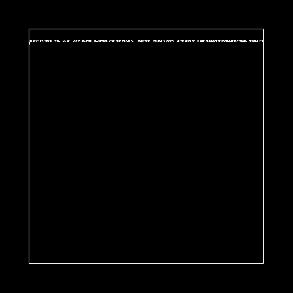
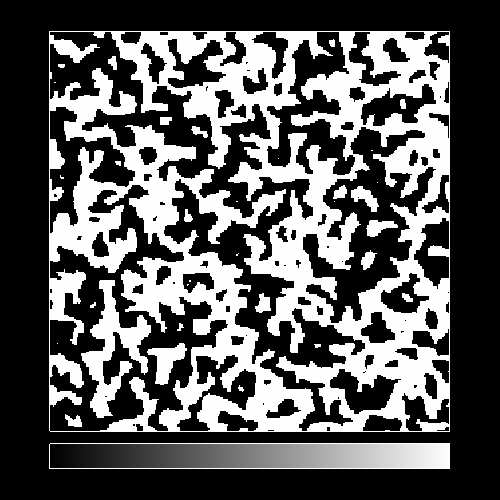
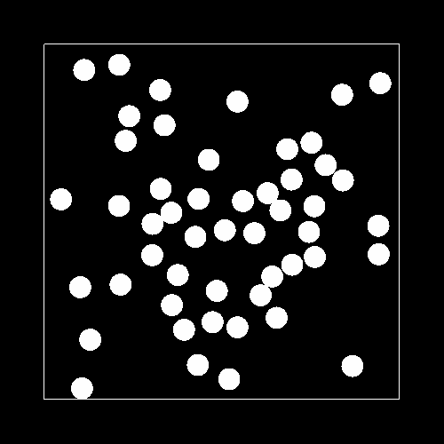
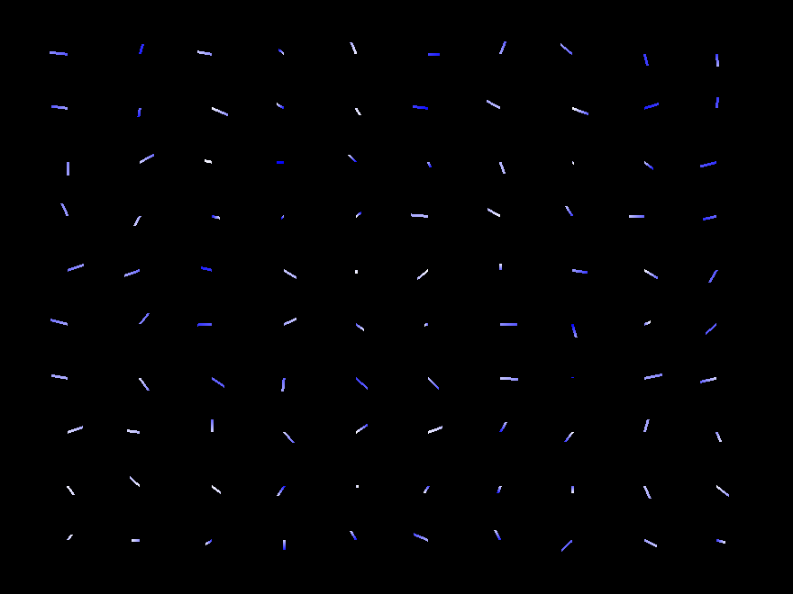
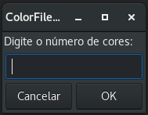
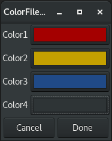

# DynamicSimulator

## Instalação:

### Distribuições Debian-based:
* `$ wget https://github.com/romcenci/DynamicSimulator/releases/download/v1.0.0/dynsim_1.0.0-1_amd64.deb`
* `# apt install ./dynsim_1.0.0-1_amd64.deb`

### Distribuições Arch-based:
* `$ wget https://github.com/romcenci/DynamicSimulator/releases/download/v1.0.0/dynsim-1.0.0-1-x86_64.pkg.tar.xz`
* `# pacman -U dynsim-1.0.0-1-x86_64.pkg.tar.xz`

### Instalação manual:
* Instalar glfw3:
	- `$ sudo apt-get install libglfw3-dev`
* Clonar o repositório com:
	- `$ git clone https://github.com/romcenci/DynamicSimulator.git`
* E então para instalar basta entrar na pasta DynamicSimulator e digitar os seguintes comandos:
	- `$ make`
	- `# sudo make install`
* Para desinstalar:
	- `# sudo make uninstall`
	
## Para rodar:
* Sintaxe:
	- `./a.out | ./DynSim -OPÇÕES`		
* Exemplo:
	- `make demos`
	- `./demos/ogl_ex2_ising.out | ./DynSim -m 2 -l 300 --height 600 --width 800 --color color.txt`
		
## Interativo:
* <kbd>Spacebar</kbd> : Pausar
* <kbd>&uparrow;</kbd> <kbd>&downarrow;</kbd> <kbd>&leftarrow;</kbd> <kbd>&rightarrow;</kbd>: Translação
* <kbd>-</kbd> <kbd>+</kbd> : Zoom
* <kbd>a</kbd> : Autoescala
* <kbd>s</kbd> : Screenshot
	
## Opções:
* -l : Tamanho do vetor (quantidade de partículas)

* -c (--color) : Especifica arquivo com paleta de cores (formato hexadecimal 0xRRGGBB)

* -h (--height) : Altura da tela
	
* -w (--width) : Largura da tela

* -b (--colorbox=right/left/top/bottom) : Nos modos 0 e 2 mostra a paleta de cores ao lado

* -g (--gif) : Gerar gif

* -f (--gif_framerate=NUM) : Framerate do gif gerado

* -m (--mode) : Modo de plot
	- 0: (1d) Rede fixa (Ex: dampedGKS)
	<figure></figure>
		
	- 1: (1d) Posição variável (Granular. Ex: Quasicristal)		
	<figure></figure>
		
	- 2: (2d) Posição fixa (Ex: Ising 2d)		
	<figure></figure>
	
	- 3: (2d) Posição variável (Granular. Ex: Gás de bilhar)
	<figure></figure>
		
	- 5: (2d) Posição fixa (Flechas. Ex: Modelo de Heisenberg)
	<figure></figure>

## Arquivo de configuração:
Escolher as opções no arquivo `dsconfig`, e rodar o simulador sem nenhuma opção, apenas `./DynSim`.
Exemplo:
```
mode:   3
L:      200
height: 500
width:  500
colorbox: right
```

## Gerador de paleta de cores:
* Dependências:
	- `sudo apt-get install yad`
	
* Rodando:

Quando executar o script `./ColorFileGen.sh`, aparecerá uma tela para escolha do número de cores:
<figure></figure>

Então, escolhe as cores:
<figure></figure>

O script irá gerar o arquivo color.txt, com as cores em formato hexadecimal.

# DynamicSimulator-octave
## Uso:

- Compilar exemplos com `make demos`
- Rodar simulação com `./dynsim.m ./demos/ex2_ising.out`
