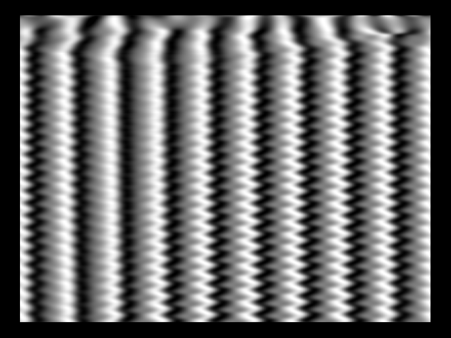
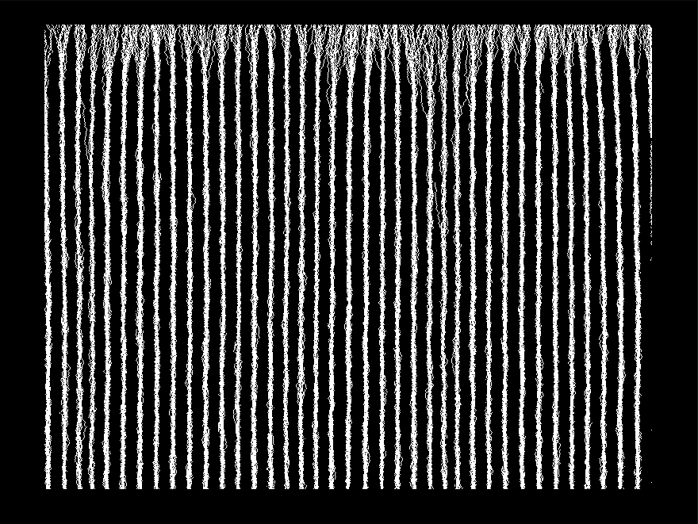
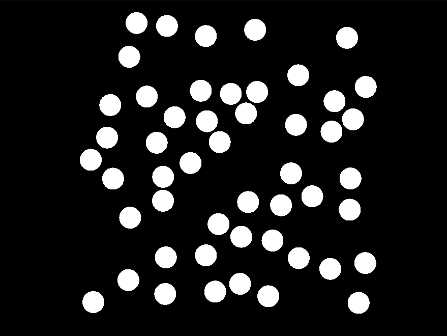

# DynamicSimulator

## Pré-requisitos:

* Instalar glfw3:
	- `sudo apt-get install libglfw3-dev`
* Clonar o repositório com:
	- `git clone --recursive https://github.com/romcenci/DynamicSimulator.git`
* Para compilar:
	- `make`

## Para rodar:
* Sintaxe:
	- `./a.out | ./DynSim -OPÇÕES`		
* Exemplo:
	- `make demos`
	- `./demos/ogl_ex2_ising.out | ./DynSim -m 2 -l 300 --height 600 --width 800 --color color.txt`
		
## Interativo:
* <kbd>Spacebar</kbd> : Pausar
* <kbd>&uparrow;</kbd> <kbd>&downarrow;</kbd> <kbd>&leftarrow;</kbd> <kbd>&rightarrow;</kbd>: Translação
* <kbd>-</kbd> <kbd>+</kbd> : Zoom
* <kbd>a</kbd> : Autoescala
* <kbd>s</kbd> : Screenshot
	
## Opções:
* -l : Tamanho do vetor (quantidade de partículas)

* -c (--color) : Especifica arquivo com paleta de cores (formato hexadecimal 0xRRGGBB)

* -h (--height) : Altura da tela
	
* -w (--width) : Largura da tela
	
* -m (--mode) : Modo de plot
	- 0: (1d) Rede fixa (Ex: dampedGKS)
	<figure></figure>
		
	- 1: (1d) Posição variável (Granular. Ex: Quasicristal)		
	<figure></figure>
		
	- 2: (2d) Posição fixa (Ex: Ising 2d)		
	<figure></figure>
		
	- 3: (2d) Posição variável (Granular. Ex: Gás de bilhar)
	<figure></figure>
		
	- 5: (2d) Posição fixa (Flechas. Ex: Modelo de Heisenberg)
	<figure></figure>

## Arquivo de configuração:
Escolher as opções no arquivo `dsconfig`, e rodar o simulador sem nenhuma opção, apenas `./DynSim`.
Exemplo:
```
mode:   3
L:      200
height: 500
width:  500
```

## Acessar de qualquer pasta:
Pode-se adicionar a pasta do simulador a variável $PATH,o que possibilita acessá-lo de qualquer outra pasta, para isso basta rodar o seguinte comando:

`echo 'export PATH=$PATH:/Caminho/para/o/DynamicSimulator' >> ~/.bash_aliases`
	
A partir dai, basta ter um arquivo dsconfig na pasta de cada projeto.

## Gerador de paleta de cores:
* Pré-requisito:
	- `sudo apt-get install yad`
	
* Rodando:

Quando executar o script `./ColorFileGen.sh`, aparecerá uma tela para escolha do número de cores:
<figure></figure>

Então, escolhe as cores:
<figure></figure>

O script irá gerar o arquivo color.txt, com as cores em formato hexadecimal.

# DynamicSimulator-octave
## Uso:

- Compilar exemplos com `make demos`
- Rodar simulação com `./dynsim.m ./demos/ex2_ising.out`
