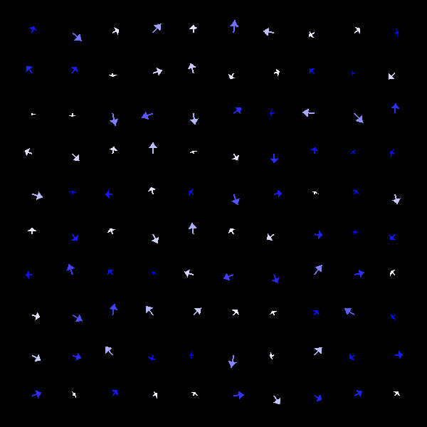

# DynamicSimulator

* **Pre-requisitos:**
	* Instalar glfw3:
		- `sudo apt-get install libglfw3-dev`
	* Clonar o repositório com:
		- `git clone --recursive https://github.com/romcenci/DynamicSimulator.git`
	* Para compilar (não necessário):
		- `gcc DynSimOpenGL2.c -lm -lGL -lglfw -Dmo=2 -DTAM=300 -DWINDOWS_WIDTH=880 -DWINDOWS_HEIGHT=660 -O3 -o DynSim`
		onde mo é o tipo de animação, e TAM é o tamanho linear
	
* **Opções:**
	* -l : Tamanho do vetor (quantidade de partículas)

	* -h (--height) : altura da tela
	
	* -w (--width) : largura da tela
	
	* -m (--mode) : Modo de plot
		- 0: (1d) Rede fixa (Ex: dampedGKS)
		<figure></figure>
		
		- 1: (1d) Posição variável (Granular. Ex: Quasicristal)		
		<figure></figure>
		
		- 2: (2d) Posição fixa (Ex: Ising 2d)		
		<figure></figure>
		
		- 3: (2d) Posição variável (Granular. Ex: Gás de bilhar)
		<figure></figure>
		
		- 5: (2d) Posição fixa (Flechas. Ex: Modelo de Heisenberg)
		<figure></figure>

* **Para rodar:**
	* Syntaxe:
		- `./a.out | ./DynSim.sh -OPÇÕES`		
	* Exemplo:
		```shell
		gcc ex2_ising.c -lm
		./a.out | ./DynSim.sh -m 2 -l 300 --height 600 --width 800
		```
	
* **Interativo:**
	* <kbd>Spacebar</kbd> : Pausar
	* <kbd>&uparrow;</kbd> <kbd>&downarrow;</kbd> <kbd>&leftarrow;</kbd> <kbd>&rightarrow;</kbd>: Translação
	* <kbd>-</kbd> <kbd>+</kbd> : Zoom
	* <kbd>a</kbd> : Autoescala
	* <kbd>s</kbd> : Screenshot
